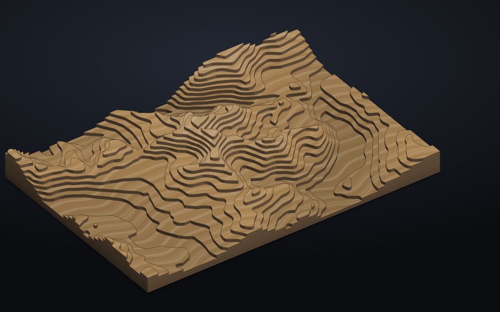
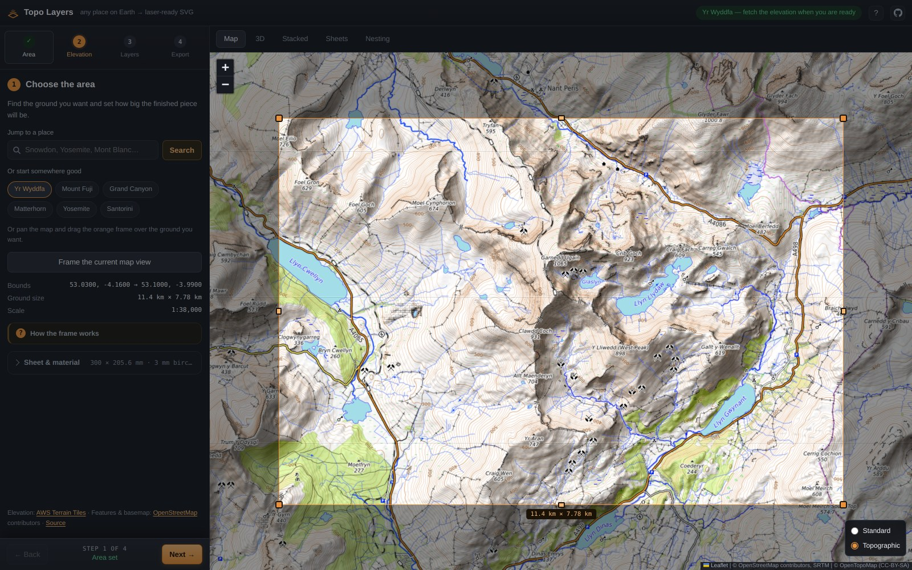
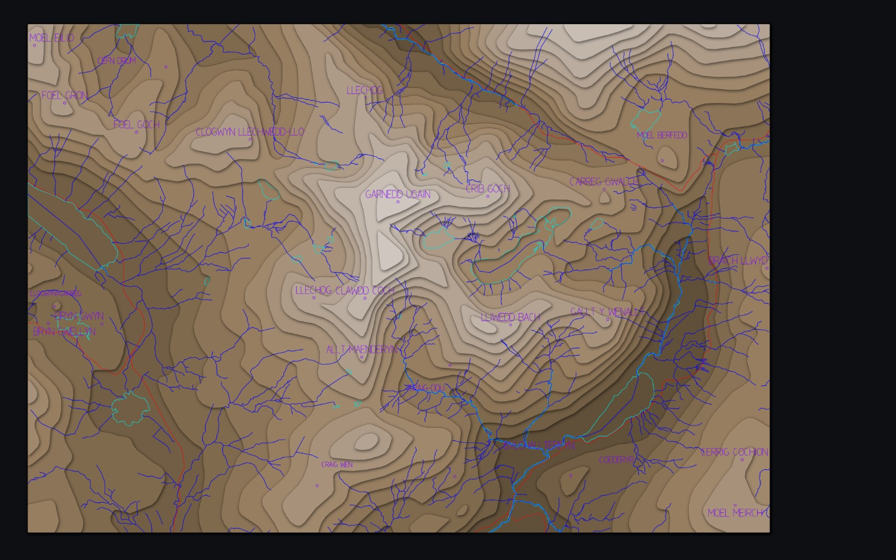

<div align="center">

# Topo Layers

**Turn any place on Earth into a stack of laser-cuttable layers.**

Pick an area on a map, choose where the contours fall, check the piece in 3D,
and download laser-ready SVGs. Free, no account, no API key, nothing to
install — it all runs in your browser.

### [→ Open Topo Layers](https://paperclipmonkey.github.io/topo-layers/)

<a href="https://paperclipmonkey.github.io/topo-layers/">
  
</a>

<sub>Snowdon, 300 × 206 mm, thirteen layers of 3 mm birch ply — the real thing, from the app.</sub>

</div>

---

Layered topographic wall art — the kind sold as a laser-cut map of a mountain
or a coastline — but where *you* choose the place, the size, the shape, the
material, and exactly which elevations to split at.

Give it a frame on the map and it fetches the terrain, slices it into contour
layers, cleans each one into geometry a laser can actually cut, engraves the
rivers, roads and place names onto the layer they belong to, packs the lot onto
your stock boards, and hands you a ZIP.

**You need** a laser cutter (or a cutting service), some sheet material, and
glue. **It costs** nothing.

### [Open a finished one ↗](https://paperclipmonkey.github.io/topo-layers/#v=1&nLevels=12&sheetW=300&sheetH=200&bbox=53.045000,-4.120000,53.098000,-4.020000&levels=141.139,216.379,291.62,366.86,442.1,517.341,592.581,667.822,743.062,818.302,893.543,968.783)

That link is Snowdon, already built — it rebuilds the whole piece in your
browser and lands on the 3D turntable with it turning. Every piece you make has
a link like it, sitting in the address bar.

## Four steps

The panel is a wizard, and only ever shows one step. A rail across the top
says which one you are on, ticks off the ones behind you, and takes you
straight to any of them; the footer says whether this step is settled and
moves you on when you are ready. Every setting lives inside the step it
belongs to — the sheet size with the area, cut quality with the layer
heights, engraving and nesting with the export — so there is no long form to
scroll past and nothing on screen that is not this step.

Each step's own action is in the step, not in the footer. Nothing hurries you
through: what the footer offers is *next*, not *do the next thing*, and it
only lights up once the step is settled.

Every group of options carries a **?** that opens a plain-English note on what
each one actually does — what kerf is for, how the four spacings differ, why
min feature wants to be two or three times your material thickness.

| | Step | What happens |
| --- | --- | --- |
| **1** | **Choose the area** | Search for a place, or drag the frame over the map. Any aspect ratio — the frame stays anchored to the ground as you pan. |
| **2** | **Fetch the elevation** | One click. Terrain heights come from an open, keyless dataset; there is nothing to sign up for. |
| **3** | **Set the layer heights** | Each layer is one sheet of material. Eight is a good start. Pick a spacing rule, or drag markers on the elevation histogram to place them by hand. |
| **4** | **Build & download** | One SVG per layer, the layers nested onto your stock boards, an alignment jig and a manifest — all in one ZIP. |

Then cut, and glue bottom layer first.

<p align="center">
  
  <br><sub><b>Step 1.</b> Drag the frame over the ground you want.</sub>
</p>

<p align="center">
  
  <br><sub><b>Checking it.</b> The finished piece from above, with rivers, lakes and place names engraved on whichever layer is the visible surface there. Zoom to 24× to check a name clears its terrace before you commit a sheet of ply to it.</sub>
</p>

## Check it in 3D before you cut

The **3D** tab builds the stack from your layers and your material thickness and
lets you turn it around — drag to turn, <kbd>shift</kbd>-drag to pan, scroll to
zoom, or tick *Spin* and leave it going.

Set your **real material thickness** on the card in the corner and the model
changes under your hand: every plate is drawn as one sheet of that stock, at
true scale against the piece, with the layer count, stack height and vertical
exaggeration reading out beside the control. The material picker — plywood, MDF,
walnut, acrylic — changes only how the preview looks: each stock is drawn with
its own figure, and birch ply gets veneer laminations down its cut edges, so a
piece in walnut reads as walnut rather than as plywood in a different colour.

Worth doing every time, because it shows how much relief you actually get, and
that is usually less than people expect: thirteen layers of 3 mm ply is 39 mm of
stack on a 300 mm piece. Seeing it beats any number.

## What comes out

| File | What it is |
| --- | --- |
| `nesting-01.svg`, … | **what you cut** — every layer packed onto stock boards |
| `01_base.svg`, `02_120m.svg`, … | one sheet per layer, bottom first, each in its own file |
| `all-layers-in-register.svg` | all layers overlaid, colour-coded — for checking alignment |
| `alignment-jig.svg` | a board with every outline engraved, to position pieces while gluing |
| `points-key.csv` | number → name, sheet and coordinates for imported points |
| `manifest.json`, `README.txt` | the exact parameters used, and cutting notes |

SVGs are in millimetre user units with a physical `width`/`height`, so they
import at true size into LightBurn, Illustrator and Inkscape. Stroke colour
separates cut from engrave, which is how most laser software assigns layers —
the full colour key is [in the reference](#reference).

## Common questions

**Do I need a laser cutter?** To cut it, yes — or a cutting service; the SVGs
are standard files any of them will take. To design a piece and look at it in
3D, no.

**What material?** 3 mm birch ply is the usual choice and what the defaults
assume. Anything you can cut works — MDF, basswood, acrylic, even greyboard.
Thicker stock means more relief per layer and a chunkier piece.

**How big should it be?** 300 × 200 mm with 8–14 layers is a good first piece.
More layers means finer terrain and a taller stack, but also more cutting and
more gluing.

**Which places work well?** Anywhere with relief: mountains, valleys, islands,
coastlines. Flat ground gives you flat art. Coastlines cut beautifully — put a
level at 0 m for the shoreline.

**Does it send my data anywhere?** No. Everything runs in your browser; the only
requests are for public map and terrain tiles. A share link never carries your
elevation API token or any GeoJSON you loaded.

**Something looks wrong in the export.** Check the **Stacked** tab zoomed in —
most surprises are a name running off its terrace or a feature smaller than the
*Min feature* setting being dropped.

## Running it locally

No build step, no `npm install`, no bundler. Clone it and serve the folder:

```bash
git clone https://github.com/paperclipmonkey/topo-layers.git
cd topo-layers
python3 serve.py          # → http://localhost:8777
```

It has to be served over HTTP rather than opened as a `file://` URL, because the
browser blocks cross-origin tile reads from `file://`. `serve.py` is just
`http.server` with caching turned off — with caching on, an edited module keeps
running from cache while the page reloads around it, which looks exactly like a
code change having no effect. Pass a port to use a different one:
`python3 serve.py 9000`.

Everything under `src/` is a plain ES module the browser loads directly, so an
edit and a refresh is the whole loop.

---

# Reference

<details>
<summary><strong>Cut and engrave colour key</strong></summary>

Stroke colour separates operations, which is how most laser software assigns
layers:

| Colour | Operation |
| --- | --- |
| `#000000` black | **cut** — part outline and pin holes |
| `#B4B4B4` grey | **engrave** — outline of the layer above, as a glue guide |
| `#00E0E0` / `#0000FF` | lakes / rivers |
| `#FF0000` / `#FF00FF` | roads / railways |
| `#FF8000` / `#00E000` | buildings / woodland |
| `#8000FF` / `#FF0080` | place names / imported points |

</details>

<details>
<summary><strong>How the 3D view is drawn</strong></summary>

There is no 3D library behind it. The layers nest strictly — each sits wholly
inside and above the one below — so with the camera above the stack, drawing
bottom plate to top plate is exactly correct painter's order, and no depth
buffer is needed. Within a plate the walls are drawn first and the top face over
them, which hides the back walls for free: a back wall projects into the
interior of its own top face, while a front wall projects clear of it.

The grain is a tile of procedural figure used as a fill pattern, and the pattern
carries a transform of its own, because the top-face projection is affine once
the plate's height is fixed. That is what keeps the figure lying on the board
rather than on the screen: without it the grain swims across a piece as it
turns. The plies down a cut edge are the plate's own outline drawn again part of
the way up — height only moves screen y — and they stop being drawn once a plate
is too shallow to tell one veneer from the next.

The model is fitted to the circle its corners turn through rather than to
whichever silhouette it happens to be presenting. A rectangle is wider corner-on
than edge-on, so fitting the current view rescaled a spinning piece every frame
and it pulsed; the circle is the tightest bound that holds for every angle, so
the piece holds still while it turns.

Zoom is anchored to the pointer, so whatever you are looking at is what you
close in on, and the outlines are re-thinned per scale, so a plate edge stays
true at any magnification rather than turning into a polygon.

Plates are one colour all the way up, as a sheet of board is, shaded by how much
light a terrace gets rather than faded light-to-dark like a height map, with the
cut edges darker and browner as the laser leaves them.

</details>

<details>
<summary><strong>Where the data comes from</strong></summary>

**Elevation** is *not* in OpenStreetMap — OSM is a vector database of nodes and
ways, and it carries almost no terrain height. So heights come from
[AWS Terrain Tiles](https://registry.opendata.aws/terrain-tiles/), an open,
keyless dataset of terrarium-encoded PNGs (SRTM globally, EU-DEM over Europe,
plus national datasets where they exist). Zoom 15 is the maximum, which is
roughly 5 m per sample at UK latitudes.

**Everything else** is OSM: the basemap, place search (Nominatim), and the
vector features — lakes, rivers, roads, railways, buildings, woodland — fetched
live from the Overpass API and engraved onto whichever layer they sit on. They
come back as lon/lat and are kept as millimetres on the sheet they were fetched
for, so moving the frame or changing the sheet size clears them: fetch them
again for the piece as it now is. Imported GeoJSON is not cleared — the file is
still to hand, so it is simply projected again.

You can swap the elevation source for Mapbox Terrain-RGB (paste a token) or any
custom `{z}/{x}/{y}` tile URL in either encoding, under *Detail and data source*
in step 2.

The basemap and Overpass are volunteer-run services on a fair-use policy — fine
for personal use, but don't point heavy traffic at them.

</details>

<details>
<summary><strong>How a layer is made</strong></summary>

1. **Elevation.** Terrain tiles covering the frame are fetched, decoded
   (`h = R·256 + G + B/256 − 32768`), mosaicked and resampled to a grid whose
   cells are square in Mercator.
2. **Levels.** Pick how many layers and where they sit: equal interval, equal
   area (quantile), or snapped to round contour intervals. Or type exact
   heights, or work directly on the elevation histogram: drag a marker to move a
   level, click open ground to add one, click a marker to remove it. Levels snap
   to round numbers unless you hold <kbd>Alt</kbd>, arrow keys nudge whichever
   one is selected, and the readout under the pointer tells you how much of the
   map lies below that height. Drag the panel edge, or the bar under the plot,
   when you want a bigger picking area; a log count scale brings out the thin
   tail of high ground that a coastal spike would otherwise flatten.
3. **Contours.** Marching squares (`d3-contour`) produces, for each level, the
   closed region of ground above it. Holes are preserved, so a caldera or a lake
   basin cuts out properly.
4. **Clean-up for the laser.** Chaikin smoothing to take the stair-step out of
   the DEM, Douglas–Peucker simplification, removal of islands and holes too
   small to survive the cut, and optional kerf compensation.
5. **Export.** One SVG per layer plus assembly aids, in a ZIP.

</details>

<details>
<summary><strong>Settings worth understanding</strong></summary>

**Min feature** drops any island smaller than roughly this square. Set it to
about 2–3× your material thickness — anything smaller tends to char through,
fall into the machine, or snap when you handle it.

**Kerf** widens each part by half the beam width so the cut piece comes out at
nominal size. Leave it at 0 if LightBurn is already applying kerf offset,
otherwise you will double up.

**Vertical exaggeration** is shown live, in the panel and beside the thickness
control in the 3D view. It is the ratio of the horizontal scale to the vertical
scale: material thickness ÷ contour interval, against ground metres per sheet
millimetre. Real terrain at 1:1 looks disappointingly flat at wall-art size, so
5–20× is normal. Change it by changing the contour interval or the material
thickness.

**Terrain smoothing** blurs the elevation grid before contouring. One or two
passes removes DEM quantisation without losing real landforms. **Curve
smoothing** rounds the resulting outlines; segments running along the sheet edge
are deliberately held rigid so the rectangle stays square.

</details>

<details>
<summary><strong>Lettering, place names and your own points</strong></summary>

Place names and peaks come from OSM and are engraved onto whichever layer is the
visible surface there. They are set in a **single-stroke font** built into the
app: the laser traces each letter's centre line once rather than clearing a
filled interior, which is far quicker to burn, stays legible down to about 2 mm,
and needs no font file, so the marks are identical on any machine. Labels are
set in capitals — the cartographic convention, and markedly clearer engraved
small. Where two labels collide the less prominent one is dropped.

**Placing a name** is the fiddly part, because a name engraved on a layer is
only visible where that layer is not covered by the plate above it, and with a
dozen layers those exposed terraces are narrow bands — so a name at its natural
position very often runs off its terrace. Each name is therefore tried at a
range of offsets around its point and at up to two smaller sizes, looking for
somewhere it sits complete on a single visible terrace. On a 12-layer test that
search alone took the proportion of lettering falling off its terrace from 33%
to under 1%.

**Names that straddle a step** decides what happens to the rest — the ones no
offset or size can fit on one terrace:

- *Split across the plates* (the default) cuts the lettering where it crosses a
  plate edge and carries it on down the next plate, exactly as a river is cut.
  Nothing is lost: the pieces are the same strokes, divided. In a 13-layer test
  this engraved all 15 names where leaving them off engraved 6.
- *Leave them off* keeps every name whole on one plate, and drops the rest.
- *Engrave over the join* ignores the terraces and takes the first free spot.

The dot stays at the true location on whatever layer is exposed *there*, which
is not necessarily the layer the name moved to.

**Smallest settlement** decides what is worth a name at all: cities only, towns
and up, villages and up, hamlets and up, or anything named. Peaks are landmarks
rather than settlements, so they are never filtered out by size. Within a size,
names are ordered by population where OSM records one, so a cap on **Max
labels** keeps the places that matter rather than whichever ones sort early in
the alphabet.

**GeoJSON import** takes Point, LineString and Polygon features. Points are
engraved as numbered markers on the layer they sit on, and the export includes
`points-key.csv` tying each number back to its name, sheet, sheet coordinates,
latitude/longitude and any custom properties from the file. Numbers are assigned
in document order *before* testing whether a point falls on the sheet, so moving
the frame never renumbers anything — which matters when a separate survey sheet
already cites those numbers. Points outside the frame keep their number and are
marked `off-sheet` in the CSV.

</details>

<details>
<summary><strong>Showing dolines and other closed depressions</strong></summary>

For karst, the thing you want to see is the closed depressions — dolines,
shakeholes, sinks — and the default level modes are bad at it. A closed
depression only appears in the stack when a level falls strictly between its
floor and its **spill point**, the lowest saddle it would overflow. Below the
floor there is no ring at all; above the spill the contour opens out and merges
into the hillside. A shallow doline sitting between two evenly-spaced levels is
therefore invisible no matter how many layers you cut.

*Show depressions* mode finds them properly. The terrain is flooded until every
cell drains to the edge (Priority-Flood); wherever the filled surface sits above
the real one is a closed depression, and the fill height is exactly its spill
elevation. Levels are then placed to put rings inside as many as possible,
weighted by depth and extent so a real doline outranks a dimple.

**Depression emphasis** is the control that matters. Spending every level on
depressions flatters the count and ruins the piece: the levels all pile into the
narrow bands where depressions live, the middle of the range gets no contour at
all, and you end up with detailed pockmarks in one featureless slab. So only
that fraction of the levels chases depressions; the rest are spread evenly and
hold the shape of the open ground. On a Mendip test area with 20 levels:

| Mode | Dolines shown | Rings |
| --- | --- | --- |
| Equal interval | 7 / 9 | 7 |
| Equal area | 6 / 9 | 6 |
| Show depressions (50% emphasis) | **9 / 9** | **18** |

The readout under the levels tells you what any mode is achieving, so you can
compare rather than guess.

Two caveats. Keep **terrain smoothing at 0** for this — smoothing flattens
shallow depressions out of existence before they can be found. And detection is
limited by the DEM: the open terrain tiles resolve roughly 5–30 m on the ground,
which finds sizeable dolines but not small shakeholes. If you have LIDAR (in the
UK, Environment Agency 1 m DTM), serve it as `{z}/{x}/{y}` terrarium tiles and
point the custom source at it — that is where this mode really pays off.

</details>

<details>
<summary><strong>Checking it in plan: the Stacked tab</strong></summary>

The **Stacked** tab draws the finished piece from above. Scroll to zoom and drag
to pan around it, up to 24×: at 1:1 a 300 mm sheet is only a few hundred pixels,
and whether a name clears its terrace or a river keeps to one plate is a
sub-millimetre question. Whatever is under the pointer stays under it as you
zoom, double-click or **Reset view** puts it back, and scrolling all the way out
returns to the fitted view.

Every engraved line is cut where it crosses onto a different plate and carried
on down the next one, so a road stays continuous over the finished stack. Three
things have to be right for that, and each was measured:

- **Find every crossing.** Each line is walked at the pitch of the coverage
  masks rather than only tested at its ends — a simplified road runs straight
  for centimetres across terrace after terrace in a single segment, and testing
  only the ends put that whole span on whichever plate the far end landed on.
  On a test with deliberately straight roads that buried 79% of the engraved
  length under the plates above; walking the segments takes it to 2%.
- **Cut in the right place.** The masks are a 0.25 mm raster, so a cut located
  on them sits up to half a cell from where the plate really ends — a visible
  nick in a road, or a letter stopping short of the step. The cut is now put
  where the line crosses the plate's actual outline, found on the line itself
  rather than by pulling it sideways onto the nearest edge, which would shorten
  the line and kink it. That halves what is left invisible, to 0.054 mm per
  crossing, and the pieces still reconstruct the original line to the
  millimetre.
- **Keep whole roads whole.** OSM starts a new way at every junction and every
  change of tag, so a road arrives as a chain of fragments, some only tens of
  metres long. Measuring each fragment against the minimum feature length
  dropped the short ones — 39 of 119 ways in a test — leaving gaps exactly
  where two stretches should meet. The chain is now stitched back together
  before anything is measured or dropped.

Engraved lines are drawn at their real width, about a fifth of a millimetre,
rather than as a fixed hairline, so zooming in does not turn something the
laser would close up into an apparent hole.

</details>

<details>
<summary><strong>Nesting onto stock</strong></summary>

Give it your stock size and it packs the layers onto as few boards as possible,
so the whole piece cuts in one job instead of one file at a time.

Each layer travels as a single rigid part — its glue-guide outline, engraved
rivers and pin holes ride along with it — so only the part's own bounding box
matters, not the full sheet it was drawn on. That is what makes the upper layers
cheap to place: a summit layer occupying 40 × 30 mm is packed as 40 × 30 mm, not
as a full sheet with a lot of empty space around it. Parts are placed by
MaxRects best-short-side-fit, largest first, and may be turned 90° where that
helps; anything engraved on a part turns with it.

*Edge margin* keeps parts clear of the board edge and starts at zero, so the
board is usable corner to corner: 400 × 600 mm stock takes a 400 × 600 mm sheet.
Raise it if your bed needs clamp room. *Part gap* keeps parts clear of each
other — set it to at least a couple of kerfs so neighbouring cuts do not run
into one another. It is a gap *between* parts only; it is not also charged
against the board edge, so it never costs you a millimetre of stock.

*Largest part* reports what the board can actually take, so a piece that does
not fit tells you by how much. Anything too large is listed rather than silently
dropped, so a base layer bigger than your board is a warning, not a missing
file.

</details>

<details>
<summary><strong>Assembly</strong></summary>

Cut bottom layer first. With *engrave outline of the layer above* switched on,
each sheet carries a faint outline showing exactly where the next piece goes —
lay the glue, drop the next sheet inside the line, repeat. The jig sheet does
the same job for the whole stack if you would rather not mark the pieces.

Pin holes are an alternative, and they are placed from the top down. The
generator starts at the summit layer, finds the point deepest inside its
material, and puts a hole there; because the layers nest, that hole then passes
down through every layer beneath it. Only when a layer does not already contain
enough holes — or contains them too close together to stop it pivoting — does it
ask for another. The result is a small number of dowels sited under the high
ground that carry the whole stack, including the small summit pieces that have
nowhere near the sheet corners to locate against.

*Per layer* is how many holes each layer should end up with (two is enough to
fix rotation). *Margin* is how much material must surround a hole; raise it if
holes are landing closer to an edge than you would like. A layer that is simply
too small to take a hole at that margin is skipped rather than weakened.

</details>

<details>
<summary><strong>Limits</strong></summary>

- Mercator, so the piece is a Mercator rectangle. Over a wall-art extent the
  distortion is invisible; over several degrees of latitude it is not.
- Kerf compensation offsets each vertex along its angle bisector with a miter
  limit. At realistic kerfs (0.05–0.25 mm) that is fine; at large values a
  tight concave notch can self-intersect.
- Overpass will refuse very large areas, especially with buildings enabled.
- Coastlines are handled implicitly: sea is below the 0 m level, so include a
  level at 0 to cut a shoreline.

</details>

<details>
<summary><strong>Deploying</strong></summary>

Pushing to `main` publishes the site — `.github/workflows/pages.yml` deploys the
repo to GitHub Pages:

```bash
git push origin main
```

Do **not** also push to `gh-pages`. Pages is configured to build from the
workflow, so a push to that branch starts a second, competing deployment; the
two fight over the deployment lock and the workflow sits at
`deployment_in_progress` until it times out. The branch is left in place but is
no longer the source, and nothing needs to go to it.

</details>

## Attribution

Elevation from [AWS Terrain Tiles](https://registry.opendata.aws/terrain-tiles/).
Map data © OpenStreetMap contributors,
[ODbL](https://www.openstreetmap.org/copyright) — keep the attribution if you
publish or sell the result.
